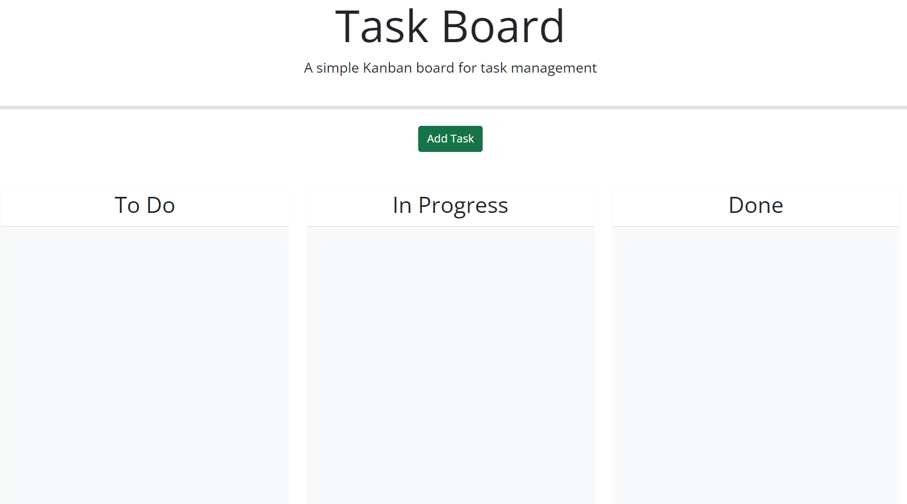
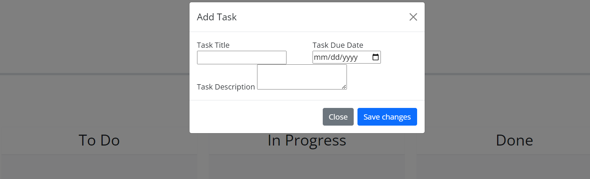
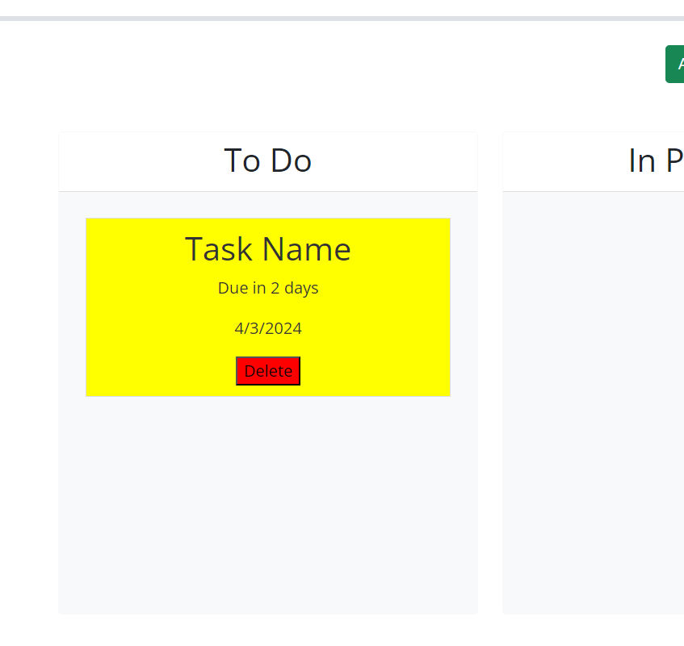
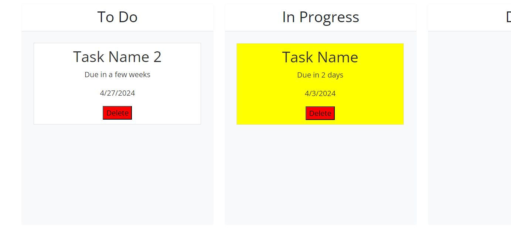

# Task Board

## Description

In this challenge, I was tasked with creating a webpage that could add and store tasks in three different categories: 'To Do', 'In Progress', and "Done'. On the webpage the user could click 'Add Task' and a form would pop up for them to add a name, due date, and description of the task. When submitted, the task would then be added to the 'To Do' section but could be moved to and from the other sections based on completion status. The task was to be also given a color based on how close it was to being due. Red for overdue, yellow for almost due, and white if it wasn't nearing the deadline. I was tasked with using local storage to make the tasks stay when the page was refreshed and deleted when the delete button was clicked. 

## Installation

To install my code, I was given the html, a css file, and 2 variables in the js file to retrieve the data from the local storage. The first step was to create a function to create a unique ID for each task when it was saved. I did this by adding 1 to the ID for every task that was added into local strorage and storing that into an array in local storage. 

I then had to create a function to handle adding a task. I did so by creating a variable with all the values of the task form as well as the unque ID. I then set this into an array in local storage so that everytime a new task was added, it would be added to the array. 

My next step was to create a function that created a task card for each object in the array. I did so by retreiving the task list from the local storage and creating a for loop for each individual object. In this for loop I added the necessary elements and appended the values from local storage to those elements. I also added styling to each card based on today's date in relation to the due date so that it would indicate how close the deadline was. Outside of the for looop, I created functions to handle making the cards draggable by using jquery elements to indicate where these draggables could be dropped.

After doing this, I had to make the delete buttons on each card woprk so that they deleted that specific task in the array stored in local storage. I did this by creating a function with a for loop containing an if statement comparing the ID of the task card with the unique ID found in local storage. If those matched, the object would be spliced from the array and removed all together. I then added this function to an event listener stored inside my funciton to create task cards so that every task had a delete button that worked when clicked.

## Usage

Once you arrive to my website you will see the a button where you can add a task. 

If clicked, a modal form will pop up asking for a task name, due date, and task description.

When saved, the newly added task will appear in the 'To Do' lane in either white, yellow, or red. White means this task still has some time to be completed. Yellow means the deadline is nearing. Red means the deadline has already passed. 

When dragged to another lane, the task card can be dropped in that lane but if it is dragged outside of the lane it will revert back to its last dropped location on the page.

When the delete button is clicked on a task, only that task will be deleted and the others will remain.

